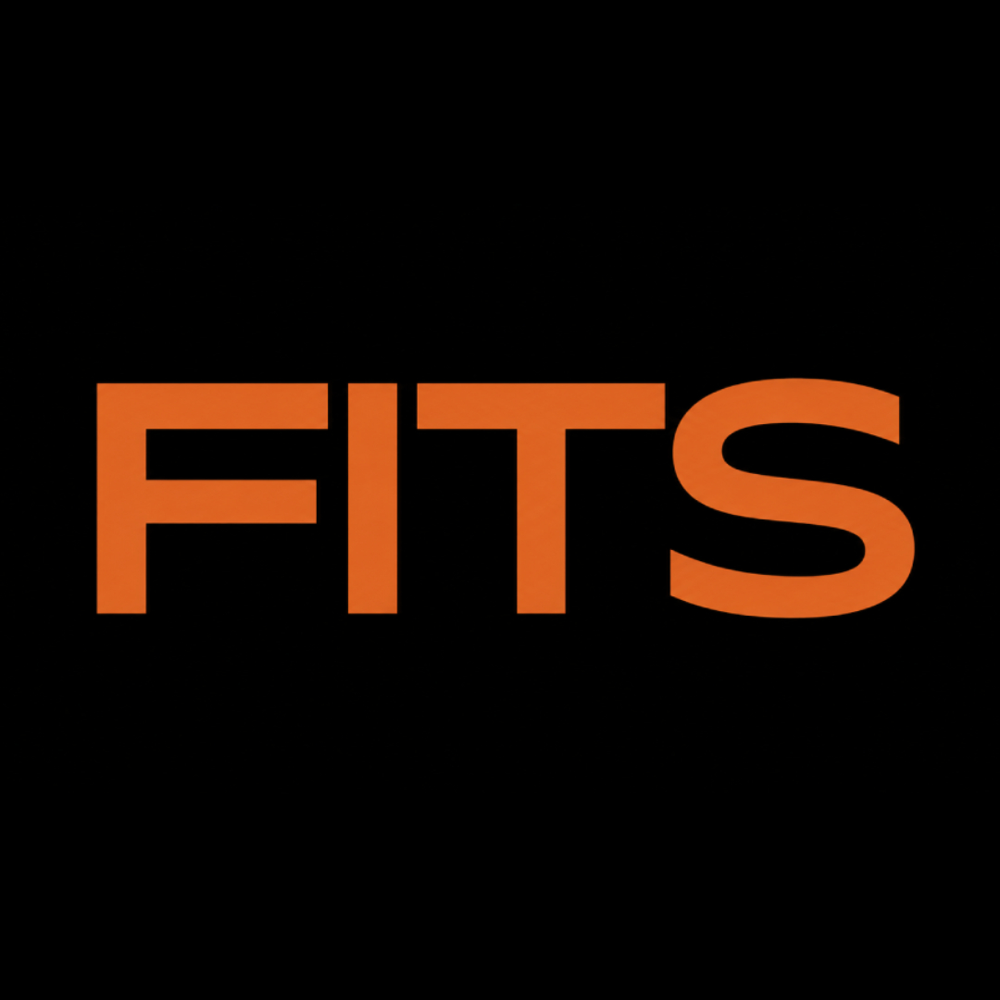

# FITS // The Autonomous AI Wardrobe & Stylist



**FITS** is a next-generation fashion companion built for the modern internet. It combines an intelligent digital wardrobe, an autonomous AI stylist named Iris, and a revolutionary **One-Click Universal Checkout** engine that can buy clothes from any retailer on your behalf using headless browser automation.

Built during the hackathon, FITS redefines how we discover, curate, and purchase fashion.

## 🚀 Key Features

* **Iris (AI Stylist):** Tell Iris where you're going (e.g., "Job Interview" or "Date Night"), and she will instantly curate a perfect outfit using pieces you already own.
* **Autonomous Universal Checkout:** Found a missing piece? Click "Buy" and our AI agent (powered by Playwright) will spin up a headless browser, navigate to the retailer (Myntra, Ajio, etc.), and complete the checkout process completely autonomously.
* **Virtual Cards (Prava API):** Secure, single-use virtual cards are dynamically generated via the Prava API for every autonomous transaction, ensuring 100% financial security.
* **Digital Wardrobe:** Upload photos of your clothes. Iris's vision models will automatically analyze, tag, and categorize them (Category, Color, Style) to build your digital closet.
* **Universal Wishlist:** Paste a link from any fashion retailer. FITS scrapes the metadata and adds it to your cross-platform wishlist.

## 🛠️ Tech Stack

* **Frontend:** Next.js 14 (App Router), React, Tailwind CSS, Framer Motion
* **Backend:** Next.js Route Handlers
* **Database & Auth:** Supabase (PostgreSQL), Clerk (Authentication)
* **AI & Vision:** OpenAI API (GPT-4o for Iris Stylist & Vision tagging)
* **Autonomous Engine:** Playwright (Headless browser automation)
* **FinTech Integration:** Prava API (Dynamic Virtual Card issuance)

## 🏎️ Getting Started

### Prerequisites

Ensure you have Node.js and npm installed on your machine.

### 1. Clone & Install

```bash
git clone https://github.com/yourusername/fits.git
cd fits
npm install
```

### 2. Environment Variables

Create a `.env.local` file in the root directory and add the following keys. (See `.env.example` if available).

```env
# Next.js
NEXT_PUBLIC_APP_URL=http://localhost:3000

# Supabase
NEXT_PUBLIC_SUPABASE_URL=your_supabase_url
NEXT_PUBLIC_SUPABASE_ANON_KEY=your_supabase_anon_key
SUPABASE_SERVICE_ROLE_KEY=your_supabase_service_role_key

# Clerk Auth
NEXT_PUBLIC_CLERK_PUBLISHABLE_KEY=your_clerk_key
CLERK_SECRET_KEY=your_clerk_secret

# AI & APIs
OPENAI_API_KEY=your_openai_api_key
PRAVA_API_KEY=your_prava_api_key
```

### 3. Run the Development Server

```bash
npm run dev
```

Open [http://localhost:3000](http://localhost:3000) in your browser to see the application.

## 🤖 The Autonomous Checkout Architecture

The crown jewel of FITS is the autonomous checkout engine located in `scripts/agent.ts`. When a user clicks "Buy":

1. The Next.js API generates a secure virtual card via **Prava**.
2. A detached Node.js process spawns the **Playwright** agent.
3. The agent navigates to the retailer, adds the item to the cart, injects the shipping details, and inputs the virtual card.
4. The transaction completes in the background without the user ever leaving the FITS app.

## 🎨 Design System

FITS utilizes a brutalist, high-contrast GenZ aesthetic:
* **Primary Brand:** FITS Orange `#D4793A`
* **Backgrounds:** Deep Charcoal/Black `#0a0a0a`
* **Typography:** Sharp, tracking-widest uppercase headers, minimalist sans-serif body text.

## ⚖️ License

Built for the hackathon.
